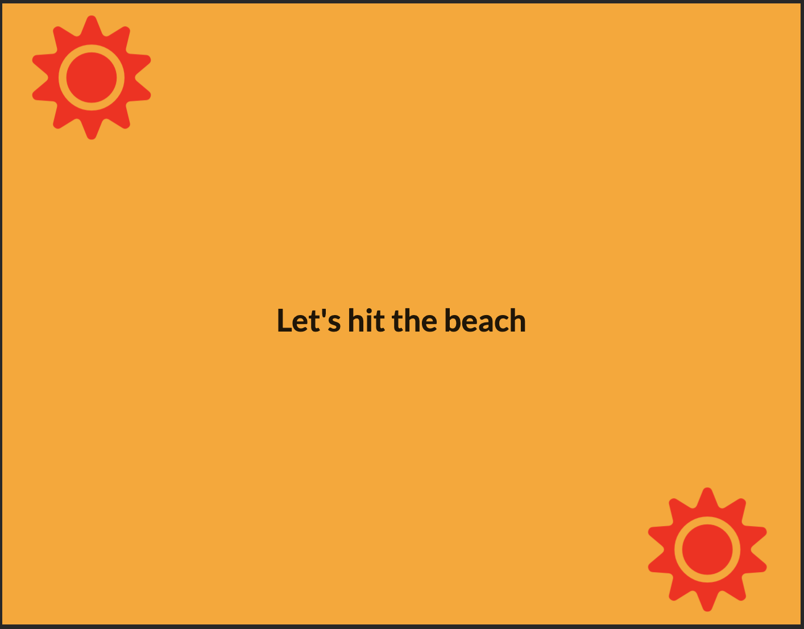
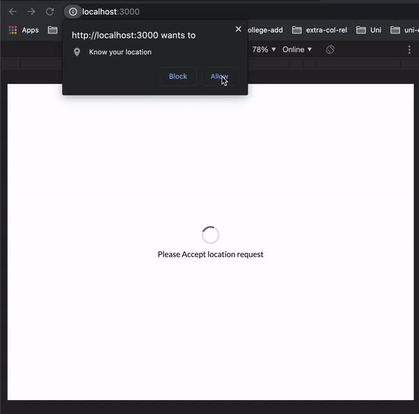

<h1>Overview</h1>

<a href="https://pracharya2601.github.io/season-finder/">Check out
</a>

This is a simple app to gind the geoloaction and find out weather it is summer or winter. Technologies like React.js, Geo Location Api, Semantic UI are used. 

<h3>Screenshot</h3>

     

     

